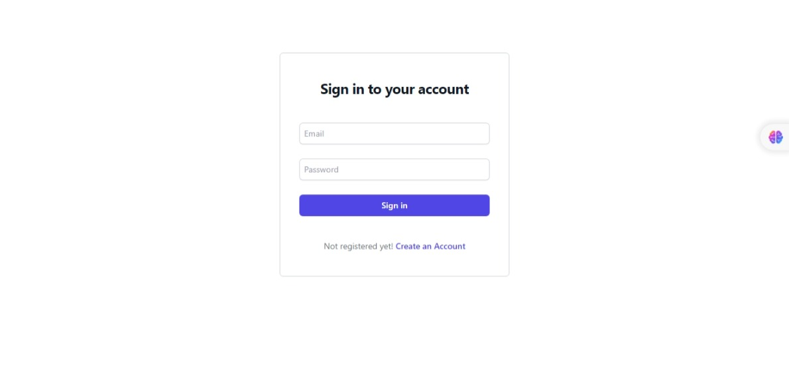
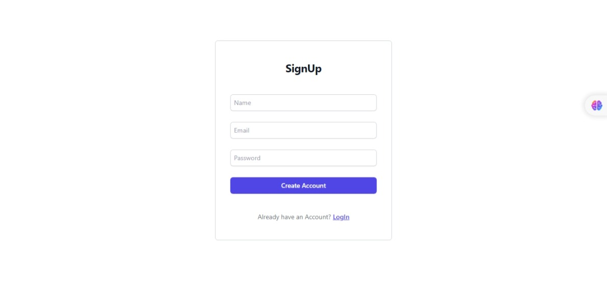
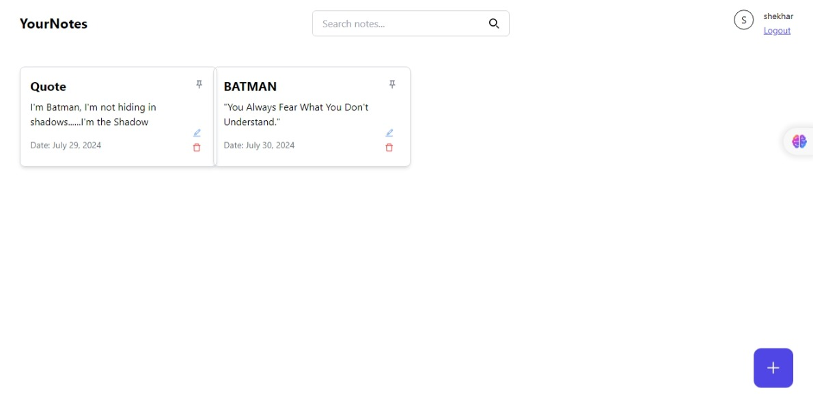

# YourNotes

## About the project

Introducing **YourNotes**, an intuitive web application crafted to elevate your note-taking experience. Whether you're a student, a professional, or a lifelong learner, YourNotes empowers you to effortlessly create, read, update, and delete notes associated with any content you engage with. With its user-friendly interface and efficient organization features, YourNotes ensures that your thoughts and insights are always at your fingertips, making it easier than ever to capture and revisit the ideas that matter most to you.

👉 [Live Demo](https://your-notess.vercel.app/)

## Features
- **Add Notes**: Users can add notes linked to specific YouTube videos.
- **View Notes**: Users can view a list of all their notes.
- **Edit Notes**: Users can edit their existing notes.
- **Delete Notes**: Users can delete notes they no longer need.
- **Search**: Users can search and filter notes for quick access.

## Tech Stack
- **Frontend**: React.js, Tailwind CSS
- **Backend**: Node.js, Express.js
- **Database**: MongoDB

## Screenshots of the Project 📸

### SignIn Page 🏡

  

### SignUp Page 🎁

  

### Dashboard 👇

  

